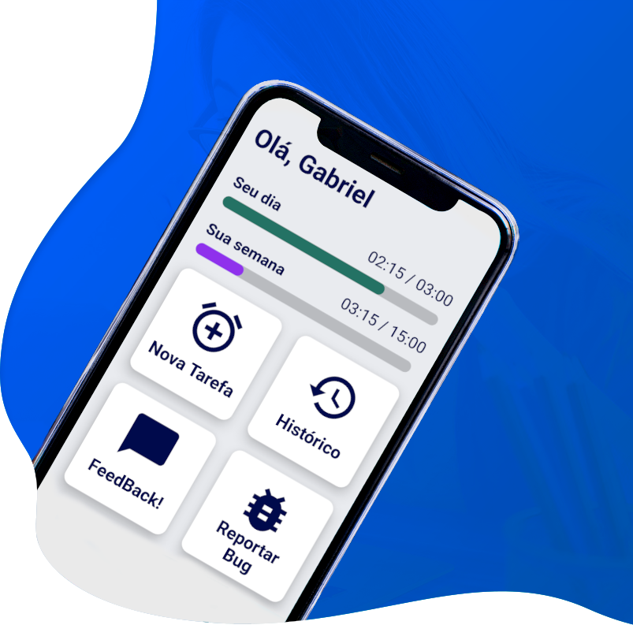

<h1 align="center">
   
  
   
  No Time Brother
   
</h1>

<h4 align="center">Um simples gestor de horas usado internamente, feito em <a href="http://electron.atom.io" target="_blank">React Native</a>.</h4>

  <a href="#key-features">Funcionalidades</a> •
  <a href="#how-to-use">Como Usar</a> •
  <a href="#download">Download</a> •
  <a href="#credits">Creditos</a> •
  <a href="#license">Licença</a>

## Funcionalidades

* Registro de horas em nuvem
* Histórico semanal de atividades
* Formulário de O.K.Rs

## Creditos

Esse software utiliza as tecnologias:

- [React Native](https://reactnative.dev/)
- [Node.js](https://nodejs.org/)
- [Firebase](https://nodejs.org/)

## License

MIT

